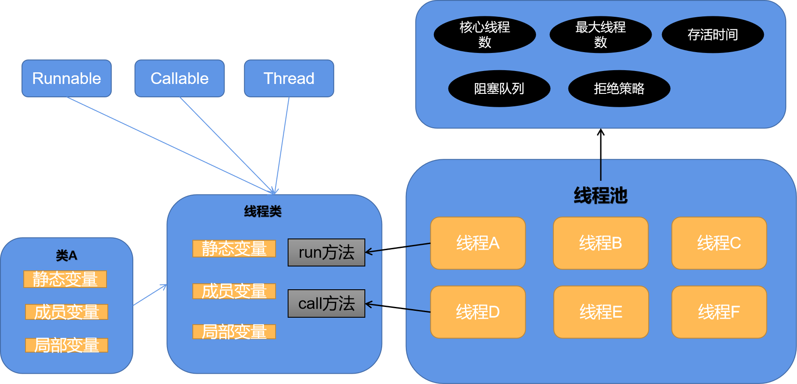

### 多线程基础的Demo，并发插入100W数据和读取100W数据
- 涉及到线程以及线程池的创建,给线程池添加线程
- 涉及到线程之间共享变量使用同步锁
- 涉及到线程本地变量
- 涉及到线程与线程之间的等待CountDownLatch的使用

### 测试数据库sql

    create table coustomer_zt
    (
        ID            int auto_increment
            primary key,
        NAME          varchar(255)  null,
        JOB           varchar(255)  null,
        PROVINCE_FLAG int default 0 null,
        AGE           int default 0 null,
        LOCAL_ADDRESS varchar(255)  null
    );

### 写法方式
- 如果需要共享变量，最好写在一个单独的类中,并且加好锁
- CountDownLatch的减少方法最好使用finally代码块执行
- 如果需要外部变量Dao，需要在创建本类全局变量，然后引用

### 关系图

