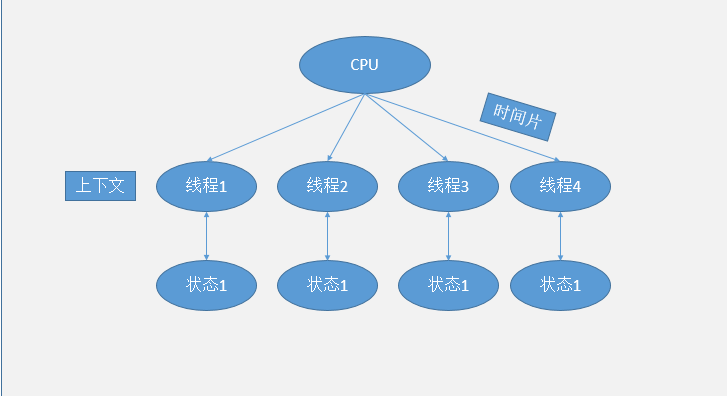

##############################
# 线程所需知识点
***
- 线程解决的问题以及应用场景
- 线程的基本实现方式
- 多线程通信
- 线程轮询

***

##### 线程解决的问题以及应用场景
- 提高程序运行的效率

##### 线程上下文

##### 
- CPU分配给每个线程单独的时间片，通过不停的切换线程，达到多线程，每个时间片不到50ms
- 每个线程在被调度之后会存一个状态，以备下次调用读取之前状态
- 上下文即线程从保存状态到再次被读取加载的过程 

1. ##### 多线程是否一定执行的快?
   不一定，多线程在数据量小于1万的情况下不如串行，在大于1000万数据的时候，优势就体现出来了
   
<table style="text-align: center">
    <tr>
        <td>循环次数</td>
        <td>串行执行时间</td>
        <td>并发执行时间</td>
    </tr>
    <tr>
            <td>5000~1亿</td>
            <td>35ms</td>
            <td>18ms</td>
    </tr>
        <tr>
                <td>500~1000万</td>
                <td>5ms</td>
                <td>5ms</td>
        </tr>
            <tr>
                    <td>10~100万</td>
                    <td>2ms</td>
                    <td>3ms</td>
            </tr>
            <tr>
                                <td>1万</td>
                                <td>0ms</td>
                                <td>0~1ms</td>
                        </tr>
</table>