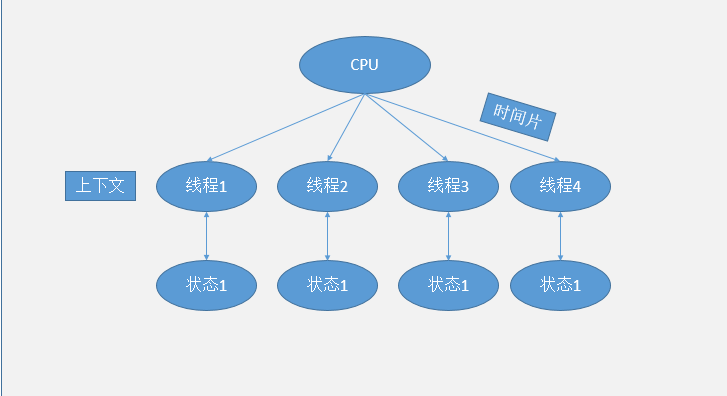
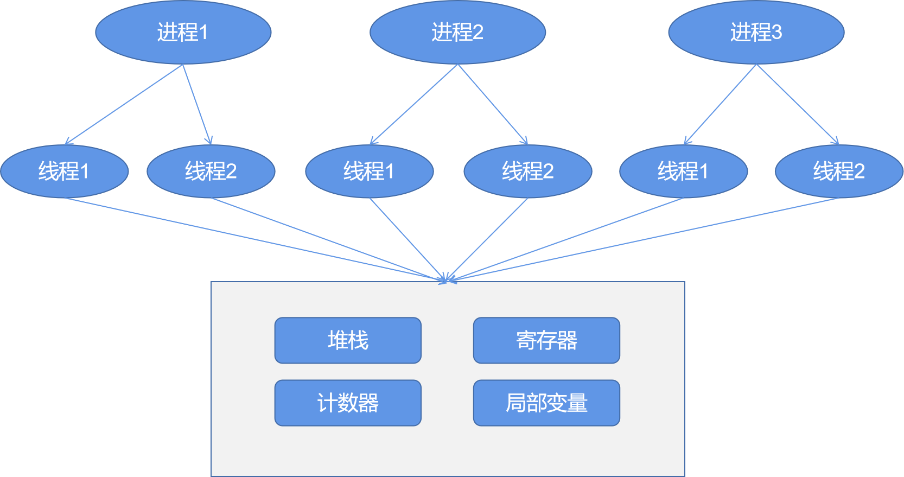
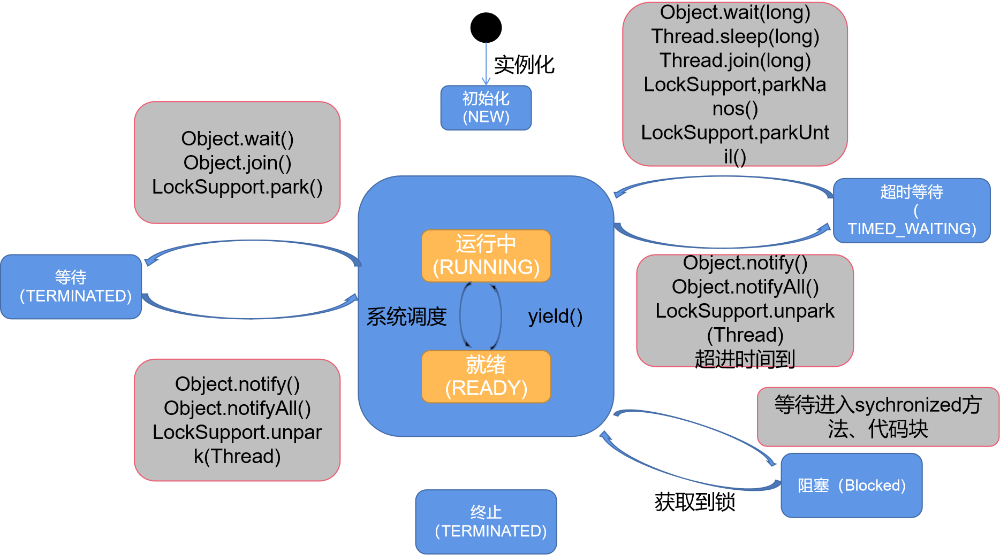

##############################
# 线程所需知识点
***
- 线程解决的问题以及应用场景
- 线程的基本实现方式
- 多线程通信
- 线程轮询

***

#### 线程解决的问题以及应用场景
- 提高程序运行的效率

#### 线程上下文

##### 
- CPU分配给每个线程单独的时间片，通过不停的切换线程，达到多线程，每个时间片不到50ms
- 每个线程在被调度之后会存一个状态，以备下次调用读取之前状态
- 上下文即线程从保存状态到再次被读取加载的过程 

- ##### 多线程是否一定执行的快?
   不一定，多线程在数据量小于1万的情况下不如串行，在大于1000万数据的时候，优势就体现出来了
   
<table style="text-align: center">
    <tr>
        <td>循环次数</td>
        <td>串行执行时间</td>
        <td>并发执行时间</td>
    </tr>
    <tr>
            <td>5000~1亿</td>
            <td>35ms</td>
            <td>18ms</td>
    </tr>
        <tr>
                <td>500~1000万</td>
                <td>5ms</td>
                <td>5ms</td>
        </tr>
            <tr>
                    <td>10~100万</td>
                    <td>2ms</td>
                    <td>3ms</td>
            </tr>
            <tr>
                                <td>1万</td>
                                <td>0ms</td>
                                <td>0~1ms</td>
                        </tr>
</table>

#### 线程与进程
   - 操作系统在运行程序的时候会创建进程
   
   - 在一个进程中可以创建多个线程
   
   - 每个线程都有自己的计数器、堆栈和寄存器
   

#### 线程优先级
   - 线程优先级是决定线程需要多分配一些资源或者少分配一些资源的属性
   - 也就是cpu给分配的时间片多少
   - 优先级高的尽量先给执行时间少的，时间多的优先级低
   - 对不同的JVM或者操作系统，线程的优先级有时候不起作用

#### 线程状态
    
    - jps 
    - jstack pid 可以通过该命令查看状态

 <table style="text-align: center">
     <tr>
         <td>状态名称</td>
         <td>描述</td>
     </tr> 
     <tr>
              <td>NEW</td>
              <td>初始状态，线程被创建，没start()</td>
          </tr> 
          <tr>
                   <td>RUNNABLE</td>
                   <td>线程运行中,指就绪和运行中</td>
               </tr> 
               <tr>
                        <td>BLOCKED</td>
                        <td>阻塞状态,表示线程被锁或其它阻塞</td>
                    </tr> 
                    <tr>
                             <td>WAITING</td>
                             <td>线程等待，进入该线程需要等待其他任务给通知</td>
                         </tr> 
                         <tr>
                                                      <td>TIME_WAITING</td>
                                                      <td>线程超时，可以自定义超时时间</td>
                                                  </tr> 
                                                  <tr>
                                                                               <td>TERMINATED</td>
                                                                               <td>终止状态，表示线程已经终止</td>
                                                                           </tr> 
 </table>
 
 - 线程中阻塞状态在concurrent包下是等待状态，
 因为使用的LockSupport类的方法
 
       